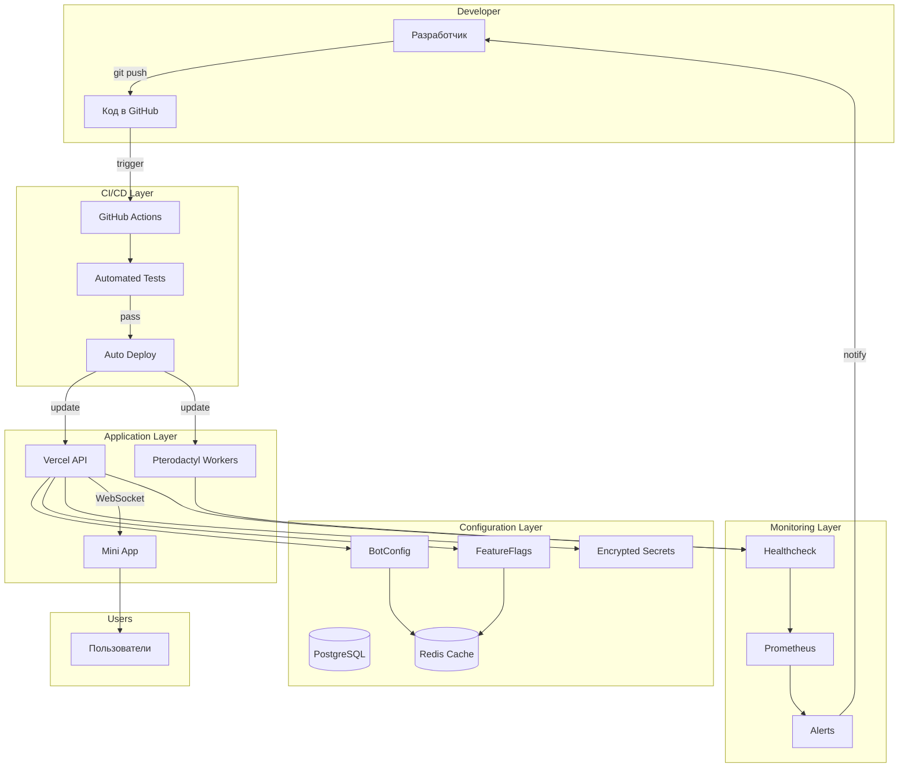
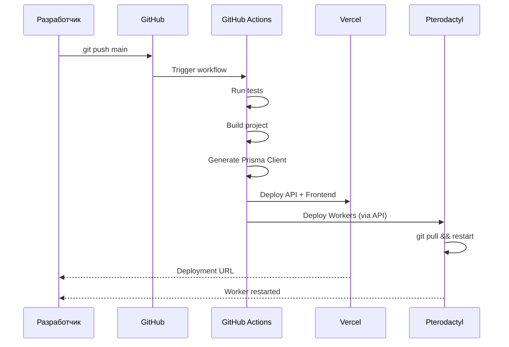
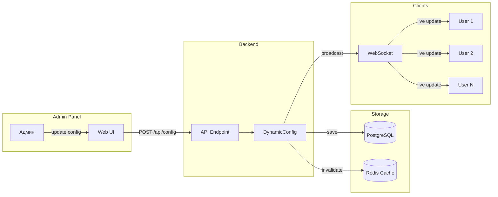
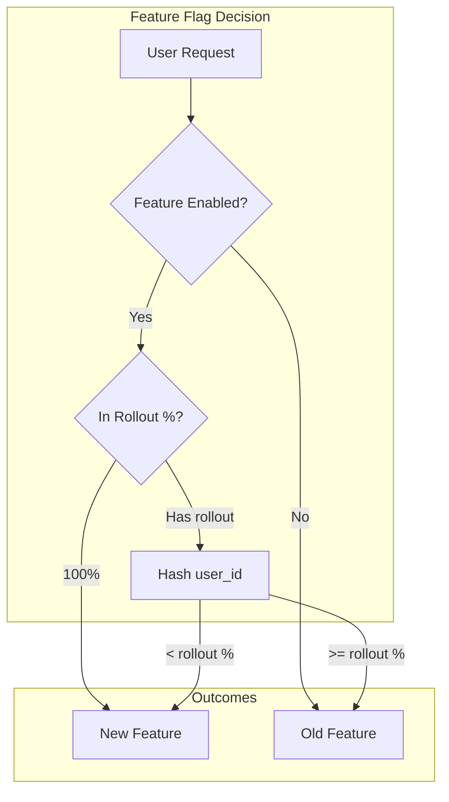
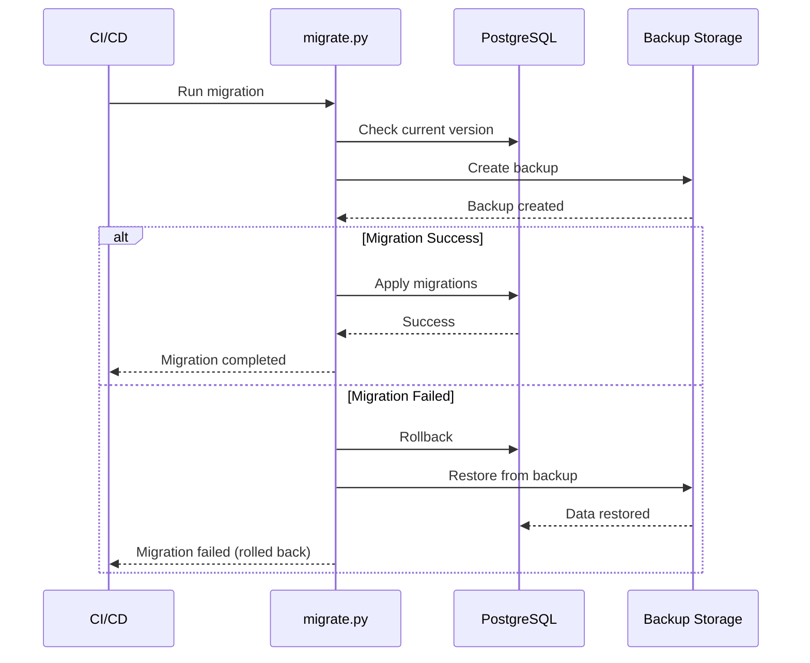
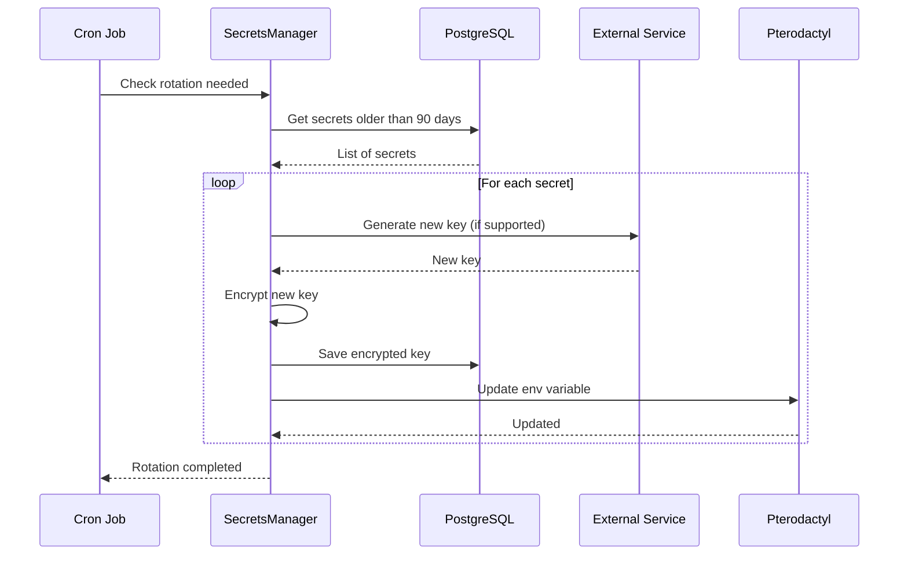
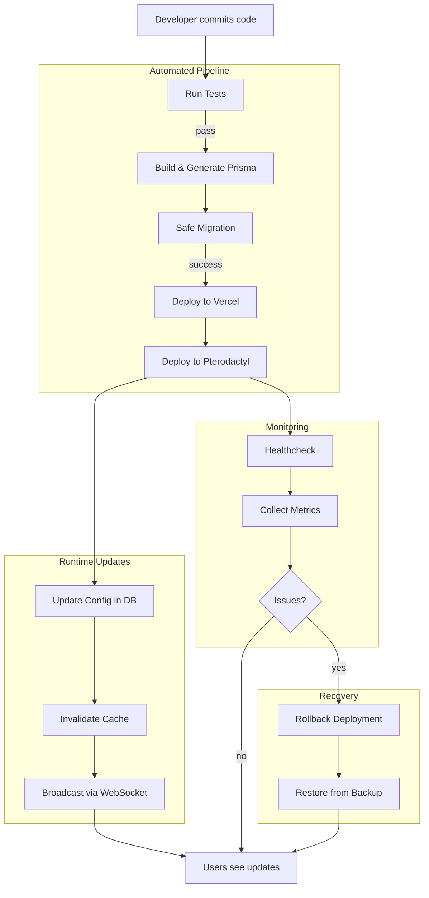
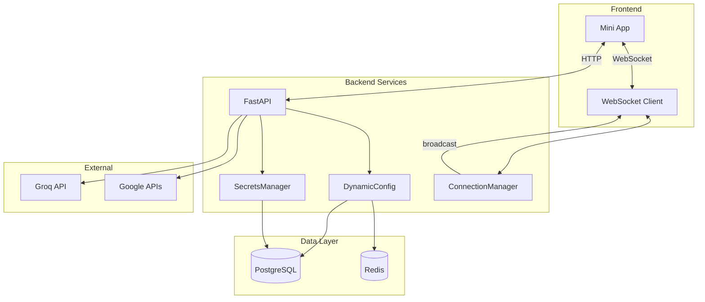
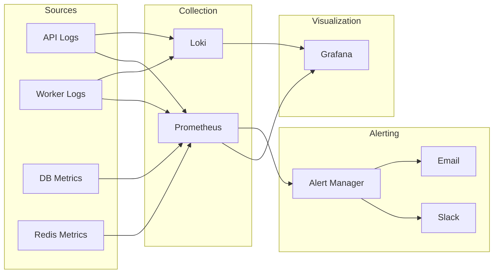
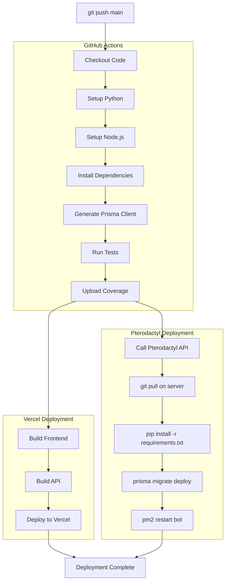

# Autonomous Architecture - Визуальная схема

## Общая архитектура автономности



## Уровень 1: CI/CD Pipeline



## Уровень 2: Dynamic Configuration



## Уровень 3: Feature Flags & A/B Testing



## Уровень 4: Safe Migrations



## Уровень 5: Self-Healing

```mermaid
graph TB
    subgraph "Worker Container"
        APP[Application]
        HEALTH[/health endpoint]
    end
    
    subgraph "Docker"
        HC[Healthcheck]
    end
    
    subgraph "Pterodactyl"
        MONITOR[Monitor]
        RESTART[Auto Restart]
    end
    
    APP --> HEALTH
    HC -->|every 30s| HEALTH
    
    HEALTH -->|200 OK| HC
    HEALTH -->|timeout/error| HC
    
    HC -->|3 failures| MONITOR
    MONITOR --> RESTART
    RESTART -->|restart container| APP
```

## Уровень 6: Secrets Rotation



## Полный цикл обновления



## Компоненты взаимодействия



## Мониторинг и алерты



## Deployment Flow



## Легенда

### Цвета и формы

- **Прямоугольник** - Процесс или компонент
- **Цилиндр** - База данных или хранилище
- **Ромб** - Условие или проверка
- **Параллелограмм** - Ввод/вывод
- **Круг** - Начало/конец процесса

### Стрелки

- **→** - Синхронный вызов
- **⇢** - Асинхронный вызов
- **↔** - Двусторонняя связь
- **⋯→** - Опциональный путь

## Использование диаграмм

Эти диаграммы можно:
1. Вставить в документацию (поддержка Mermaid)
2. Экспортировать в PNG/SVG через Mermaid Live Editor
3. Использовать в презентациях
4. Показать команде для понимания архитектуры

## Инструменты для просмотра

- **GitHub/GitLab** - нативная поддержка Mermaid
- **VS Code** - расширение Mermaid Preview
- **Mermaid Live Editor** - https://mermaid.live
- **Obsidian** - нативная поддержка
- **Notion** - через embed

---

**Примечание**: Все диаграммы написаны на Mermaid и могут быть отредактированы в любом текстовом редакторе.
