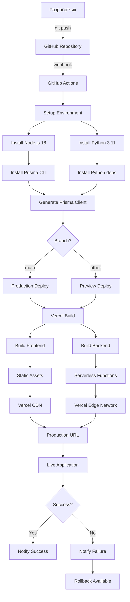
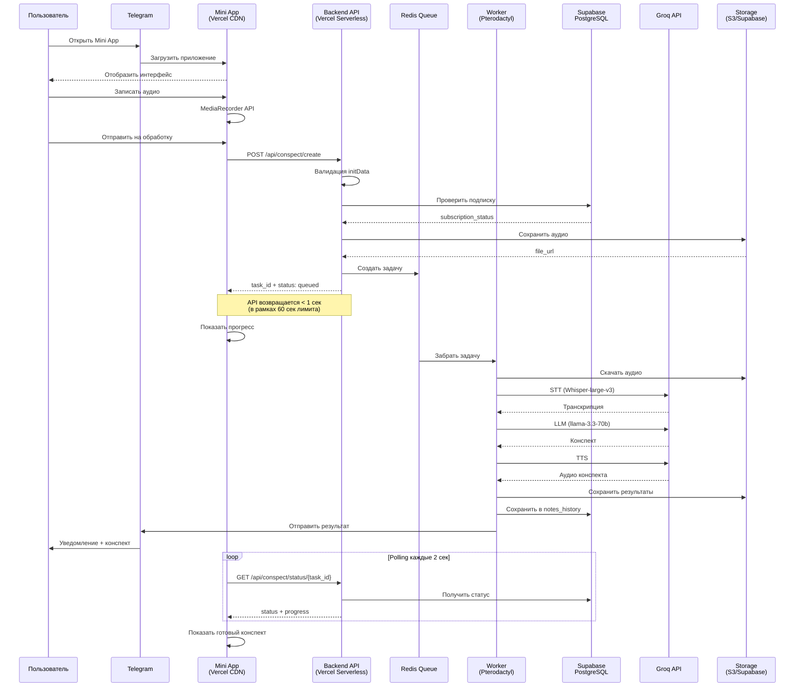
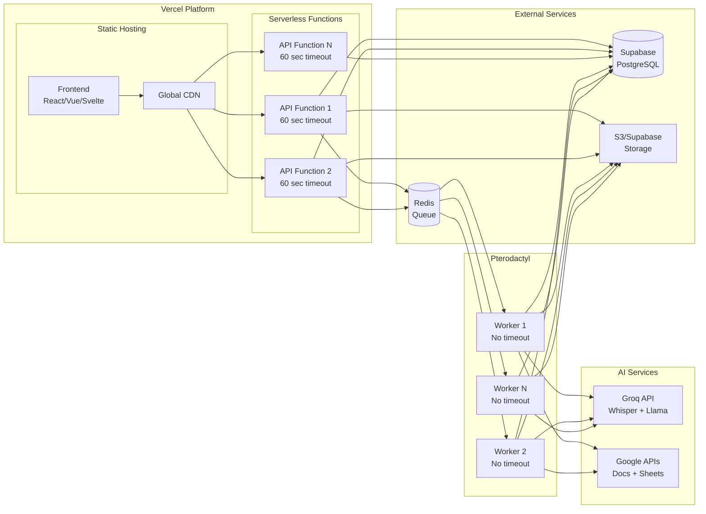
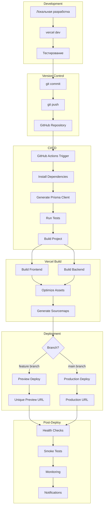
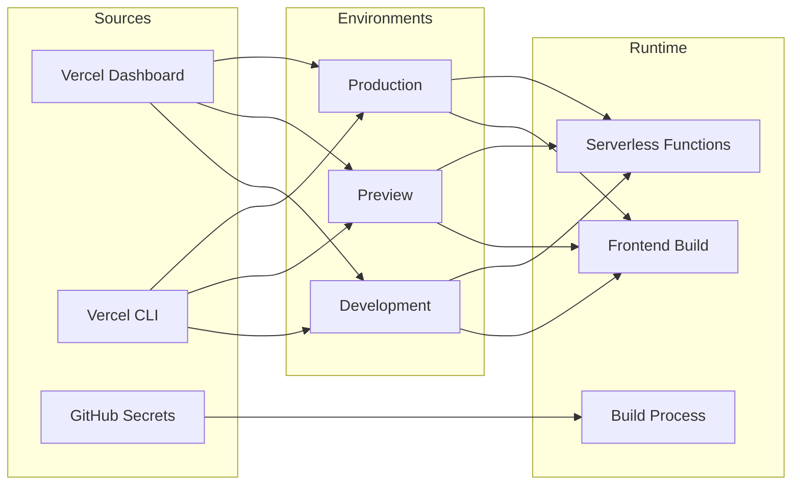
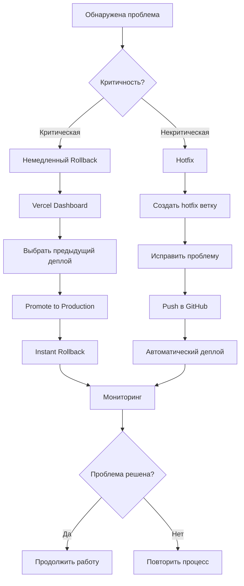
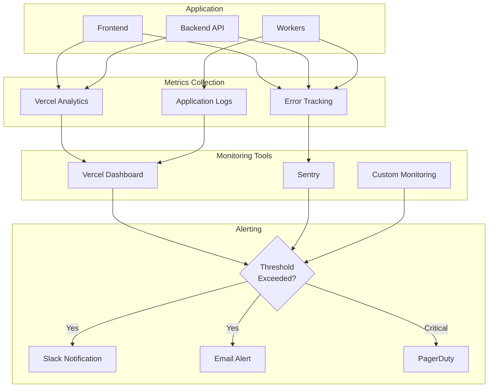
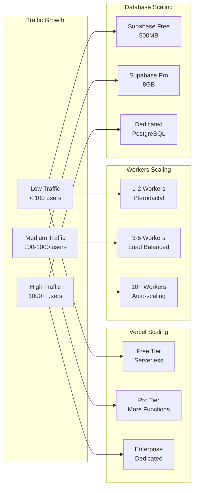
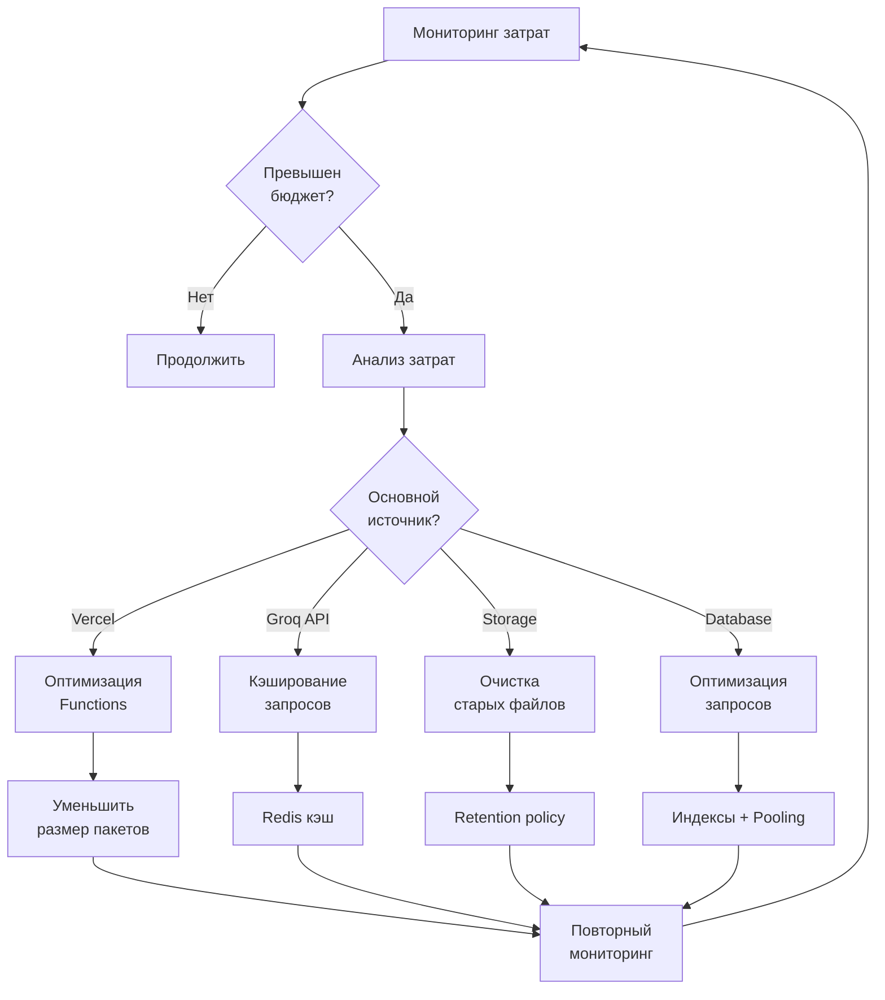

# Deployment Flow: Визуальная схема автоматического деплоя

## Полный цикл разработки и деплоя



## Детальный flow обработки запроса



## Архитектура компонентов



## Deployment Pipeline



## Environment Variables Flow



## Rollback Strategy



## Monitoring & Alerting Flow



## Scaling Strategy



## Cost Optimization Flow



## Полезные команды для каждого этапа

### Development
```bash
vercel dev                    # Локальная разработка
vercel env pull              # Загрузить env переменные
```

### Deployment
```bash
vercel                       # Preview деплой
vercel --prod               # Production деплой
```

### Monitoring
```bash
vercel logs                  # Просмотр логов
vercel logs --follow        # Real-time логи
vercel inspect [url]        # Детали деплоя
```

### Management
```bash
vercel ls                    # Список деплоев
vercel rm [url]             # Удалить деплой
vercel rollback             # Откат на предыдущую версию
```

### Environment
```bash
vercel env ls               # Список переменных
vercel env add [name]       # Добавить переменную
vercel env rm [name]        # Удалить переменную
```

## Следующие шаги

1. ✅ Изучить deployment flow
2. ⏭️ Настроить автоматический деплой (см. QUICKSTART.md)
3. ⏭️ Пройти deployment checklist (см. DEPLOYMENT-CHECKLIST.md)
4. ⏭️ Настроить мониторинг
5. ⏭️ Оптимизировать производительность
