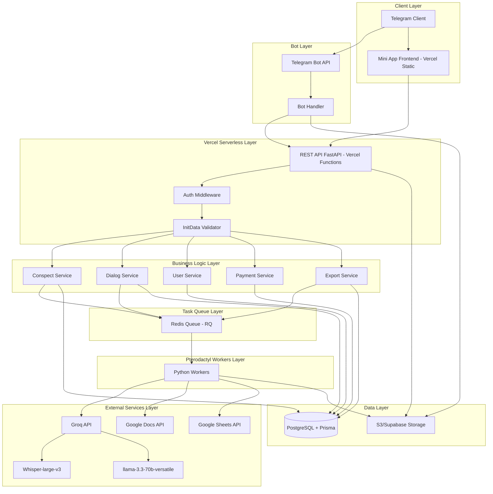
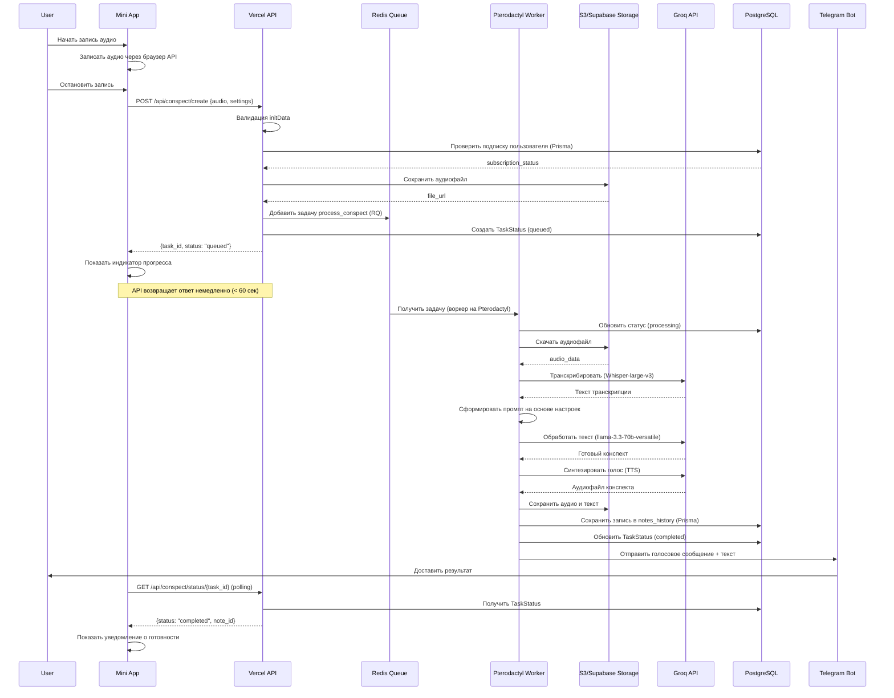
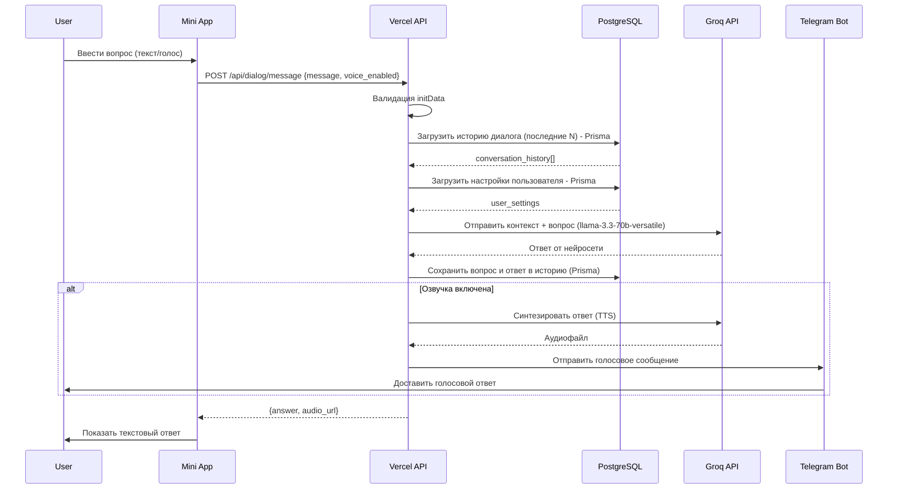
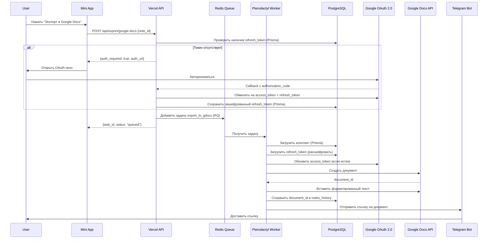

# Design Document: Telegram Smart Assistant Bot

## Overview

Telegram-бот "Умный ассистент" представляет собой интеллектуальную систему с Mini App интерфейсом, предоставляющую два основных режима работы: конспектирование аудиозаписей с автоматической обработкой через STT/LLM/TTS и диалоговый помощник с поддержкой голосового и текстового взаимодействия. Система построена на микросервисной архитектуре с асинхронной обработкой задач, интеграцией внешних AI-сервисов и гибкой системой настроек пользователя.

Архитектура включает три основных слоя: фронтенд (Mini App на React/Vue/Svelte, хостинг на Vercel), бэкенд (Python FastAPI на Vercel для легких запросов, тяжелые воркеры на Pterodactyl) с очередями задач (Redis Queue), и слой интеграции с внешними AI-сервисами (Groq Whisper-large-v3 для STT, Groq llama-3.3-70b-versatile для LLM, TTS). База данных PostgreSQL с Prisma Client Python ORM хранит пользовательские данные, настройки, историю диалогов и конспектов. Файловое хранилище (S3/Supabase Storage) используется для аудиофайлов. Система поддерживает экспорт конспектов в различные форматы (PDF, Google Docs, Google Sheets, Markdown, DOCX), монетизацию через Telegram Stars/ЮKassa и обеспечивает безопасность через валидацию initData, OAuth 2.0 для Google интеграций и шифрование токенов.

## Architecture



## Sequence Diagrams

### Конспектирование аудиозаписи (асинхронная обработка)




### Диалоговый помощник



### Экспорт конспекта в Google Docs



## Components and Interfaces

### Component 1: Mini App Frontend

**Purpose**: Предоставляет пользовательский интерфейс для взаимодействия с ботом через Telegram Mini App

**Interface**:
```typescript
interface MiniAppAPI {
  // Конспектирование
  startRecording(): Promise<void>
  stopRecording(): Promise<Blob>
  createConspect(audio: Blob, settings: ConspectSettings): Promise<TaskResponse>
  getConspectStatus(taskId: string): Promise<TaskStatus>
  getConspectHistory(): Promise<Note[]>
  
  // Экспорт
  exportToPDF(noteId: string): Promise<Blob>
  exportToGoogleDocs(noteId: string): Promise<string>  // Returns document URL
  exportToGoogleSheets(noteId: string): Promise<string>  // Returns spreadsheet URL
  exportToMarkdown(noteId: string): Promise<string>
  exportToDOCX(noteId: string): Promise<Blob>
  exportToTXT(noteId: string): Promise<string>
  getGoogleAuthUrl(): Promise<string>
  
  // Диалог
  sendMessage(message: string, voiceEnabled: boolean): Promise<DialogResponse>
  getDialogHistory(): Promise<Message[]>
  clearDialogHistory(): Promise<void>
  
  // Настройки и профиль
  getUserProfile(): Promise<UserProfile>
  updateSettings(settings: UserSettings): Promise<void>
  getSubscriptionStatus(): Promise<SubscriptionInfo>
}

interface ConspectSettings {
  style: 'detailed' | 'brief' | 'bullet_points' | 'summary'
  structure: 'chronological' | 'thematic' | 'hierarchical'
  include_terms: boolean
  include_dates: boolean
  include_formulas: boolean
  max_length: number
  special_mode?: 'cheatsheet' | 'action_items' | 'diarization' | 'glossary'
  language: string
}
```


**Responsibilities**:
- Запись аудио через браузерный MediaRecorder API
- Отображение 4 основных экранов с нижней навигацией
- Управление состоянием приложения (React Context/Vuex/Svelte Store)
- Валидация пользовательского ввода
- Отображение индикаторов прогресса и уведомлений
- Адаптивный дизайн для различных размеров экрана

### Component 2: Backend API Service

**Purpose**: Обрабатывает HTTP запросы от Mini App и Telegram Bot, управляет бизнес-логикой

**Interface**:
```python
class BackendAPI:
    # Конспектирование
    def create_conspect(user_id: int, audio_file: bytes, settings: dict) -> dict
    def get_conspect_status(user_id: int, task_id: str) -> dict
    def get_conspect_history(user_id: int, limit: int, offset: int) -> list
    def delete_conspect(user_id: int, note_id: str) -> bool
    
    # Экспорт
    def export_to_pdf(user_id: int, note_id: str) -> bytes
    def export_to_google_docs(user_id: int, note_id: str) -> dict
    def export_to_google_sheets(user_id: int, note_id: str) -> dict
    def export_to_markdown(user_id: int, note_id: str) -> str
    def export_to_docx(user_id: int, note_id: str) -> bytes
    def export_to_txt(user_id: int, note_id: str) -> str
    def get_google_auth_url(user_id: int) -> str
    def handle_google_oauth_callback(user_id: int, code: str) -> dict
    
    # Диалог
    def send_dialog_message(user_id: int, message: str, voice_enabled: bool) -> dict
    def get_dialog_history(user_id: int, limit: int) -> list
    def clear_dialog_history(user_id: int) -> bool
    
    # Пользователь и настройки
    def get_user_profile(user_id: int) -> dict
    def update_user_settings(user_id: int, settings: dict) -> bool
    def get_subscription_status(user_id: int) -> dict
    
    # Аутентификация
    def validate_init_data(init_data: str) -> dict
    def check_subscription(user_id: int) -> bool
```

**Responsibilities**:
- Валидация initData от Telegram Mini App
- Проверка подписки и лимитов пользователя
- Маршрутизация запросов к соответствующим сервисам
- Управление сессиями и аутентификацией
- Обработка ошибок и возврат стандартизированных ответов
- Логирование запросов и мониторинг
- Работа в рамках ограничений Vercel (60 сек timeout, 250 MB размер пакета)
- Делегирование тяжелых задач воркерам на Pterodactyl через Redis Queue

### Component 3: Conspect Service

**Purpose**: Управляет процессом создания конспектов из аудиозаписей

**Interface**:
```python
class ConspectService:
    def process_audio_to_conspect(
        audio_file_path: str,
        settings: ConspectSettings,
        user_id: int
    ) -> ConspectResult
    
    def transcribe_audio(audio_file_path: str) -> str
    def generate_conspect(transcript: str, settings: ConspectSettings) -> str
    def synthesize_speech(text: str, voice_settings: dict) -> bytes
    def save_conspect(user_id: int, conspect_data: dict) -> str
    def build_llm_prompt(transcript: str, settings: ConspectSettings) -> str
```

**Responsibilities**:
- Координация процесса STT → LLM → TTS
- Формирование промптов на основе пользовательских настроек
- Обработка специальных режимов (шпаргалка, action items, диаризация)
- Сохранение результатов в базу данных и файловое хранилище
- Отправка уведомлений пользователю через Telegram Bot


### Component 4: Dialog Service

**Purpose**: Управляет диалоговым взаимодействием с пользователем через LLM

**Interface**:
```python
class DialogService:
    def process_message(
        user_id: int,
        message: str,
        voice_enabled: bool
    ) -> DialogResponse
    
    def get_conversation_context(user_id: int, limit: int) -> list
    def build_dialog_prompt(context: list, message: str, settings: dict) -> str
    def call_llm(prompt: str, settings: dict) -> str
    def save_message(user_id: int, role: str, message: str) -> None
    def clear_history(user_id: int) -> bool
```

**Responsibilities**:
- Управление контекстом диалога (последние N сообщений)
- Формирование промптов с учетом истории и настроек
- Интеграция с LLM сервисами
- Опциональная озвучка ответов через TTS
- Сохранение истории диалога в базу данных

### Component 5: Task Queue Worker (Redis Queue на Pterodactyl)

**Purpose**: Асинхронная обработка длительных задач (STT, LLM, TTS, экспорт) на выделенных серверах

**Interface**:
```python
@rq.job
def process_conspect_task(
    task_id: str,
    user_id: int,
    audio_file_url: str,
    settings: dict
) -> dict

@rq.job
def transcribe_audio_task(audio_file_url: str) -> str

@rq.job
def generate_conspect_task(transcript: str, settings: dict) -> str

@rq.job
def synthesize_speech_task(text: str, voice_settings: dict) -> str

@rq.job
def export_to_pdf_task(note_id: str, user_id: int) -> bytes

@rq.job
def export_to_google_docs_task(note_id: str, user_id: int) -> str

@rq.job
def export_to_google_sheets_task(note_id: str, user_id: int) -> str
```

**Responsibilities**:
- Выполнение задач в фоновом режиме на серверах Pterodactyl
- Обработка длинных аудио (> 1 час) без ограничений по времени
- Обработка ошибок и повторные попытки
- Обновление статуса задач в Redis
- Масштабирование обработки через несколько воркеров
- Мониторинг производительности и очередей через Pterodactyl панель
- Скачивание файлов из S3/Supabase Storage
- Загрузка результатов обратно в хранилище

### Component 6: Export Service

**Purpose**: Управляет экспортом конспектов в различные форматы (PDF, Google Docs, Google Sheets, Markdown, DOCX)

**Interface**:
```python
class ExportService:
    def export_to_pdf(note_id: str, user_id: int) -> bytes
    def export_to_google_docs(note_id: str, user_id: int) -> str  # Returns document URL
    def export_to_google_sheets(note_id: str, user_id: int) -> str  # Returns spreadsheet URL
    def export_to_markdown(note_id: str, user_id: int) -> str
    def export_to_docx(note_id: str, user_id: int) -> bytes
    def export_to_txt(note_id: str, user_id: int) -> str
    
    # OAuth 2.0 для Google интеграций
    def get_google_auth_url(user_id: int, redirect_uri: str) -> str
    def handle_google_oauth_callback(user_id: int, code: str) -> dict
    def refresh_google_access_token(user_id: int) -> str
    def encrypt_refresh_token(token: str) -> str
    def decrypt_refresh_token(encrypted_token: str) -> str
```

**Responsibilities**:
- Генерация PDF с форматированием (заголовки, списки, выделение терминов) через fpdf2
- OAuth 2.0 авторизация для Google Docs/Sheets (один раз на пользователя)
- Безопасное хранение и обновление refresh tokens в БД (зашифрованно)
- Создание документов в Google Docs с форматированием через Google Docs API
- Экспорт структурированных данных в Google Sheets (action items, глоссарий)
- Генерация Markdown и plain text форматов
- Генерация DOCX через python-docx
- Автоматическое обновление access tokens при истечении
- Обработка ошибок Google API и retry логика

### Component 7: External AI Services Integration

**Purpose**: Интеграция с Groq API для STT, LLM и TTS, а также с Google APIs для экспорта

**Interface**:
```python
class GroqService:
    def transcribe(audio_file_path: str, language: str) -> str  # Whisper-large-v3
    def generate_text(prompt: str, max_tokens: int, temperature: float) -> str  # llama-3.3-70b-versatile
    def synthesize_speech(text: str, voice: str, speed: float) -> bytes  # TTS

class GoogleAPIService:
    def create_document(title: str, content: str, access_token: str) -> str  # Returns document_id
    def format_document(document_id: str, formatting: dict, access_token: str) -> None
    def create_spreadsheet(title: str, data: list, access_token: str) -> str  # Returns spreadsheet_id
    def insert_rows(spreadsheet_id: str, rows: list, access_token: str) -> None
```

**Responsibilities**:
- Интеграция с Groq API через официальный Python SDK (groq)
- Поддержка синхронных и асинхронных вызовов Groq
- Использование Whisper-large-v3 для аудиотранскрибации (очень низкая задержка)
- Использование llama-3.3-70b-versatile для генерации конспектов и диалогов
- Chat completions для диалогов с контекстом
- Интеграция с Google Docs API через google-api-python-client
- Интеграция с Google Sheets API
- Обработка API ключей и OAuth токенов
- Retry логика при сбоях
- Мониторинг использования и затрат
- Обработка rate limits Groq API

### Component 8: Dynamic Configuration Service

**Purpose**: Управление динамической конфигурацией бота без перезапуска

**Interface**:
```python
class DynamicConfig:
    async def get_config(key: str, default: Any = None) -> Any
    async def set_config(key: str, value: Any, description: str = None) -> None
    async def is_feature_enabled(feature_name: str, user_id: int = None) -> bool
    async def enable_feature(feature_name: str, rollout: int = 100) -> None
    async def disable_feature(feature_name: str) -> None
```

**Responsibilities**:
- Хранение конфигурации в БД (модель BotConfig)
- Кэширование конфигов в Redis (TTL: 1 минута)
- Управление Feature Flags с A/B тестированием
- Постепенный rollout новых функций (0-100%)
- Инвалидация кэша при обновлении
- Уведомление клиентов через WebSocket о изменениях

### Component 9: Secrets Manager

**Purpose**: Безопасное хранение и автоматическая ротация API ключей

**Interface**:
```python
class SecretsManager:
    async def get_secret(service: str, key_name: str) -> str
    async def rotate_secret(service: str, key_name: str, new_value: str) -> None
    async def check_rotation_needed() -> list
    async def encrypt_value(value: str) -> str
    async def decrypt_value(encrypted: str) -> str
```

**Responsibilities**:
- Шифрование секретов в БД (AES-256)
- Fallback на переменные окружения
- Автоматическая ротация ключей (каждые 90 дней)
- Обновление env переменных в Pterodactyl через API
- Логирование всех операций с секретами
- Уведомления о необходимости ротации

### Component 10: WebSocket Manager

**Purpose**: Управление WebSocket подключениями для live updates

**Interface**:
```python
class ConnectionManager:
    async def connect(websocket: WebSocket, user_id: int) -> None
    def disconnect(websocket: WebSocket, user_id: int) -> None
    async def send_to_user(user_id: int, message: dict) -> None
    async def broadcast_config_update(config_key: str, new_value: Any) -> None
    async def notify_task_completed(user_id: int, task_id: str) -> None
```

**Responsibilities**:
- Управление активными WebSocket подключениями
- Отправка уведомлений конкретным пользователям
- Broadcast обновлений конфигурации всем клиентам
- Keep-alive через ping/pong
- Автоматическое переподключение при разрыве
- Обработка множественных подключений одного пользователя

## Data Models

### Model 1: User

```python
class User:
    user_id: int  # Telegram user ID (primary key)
    telegram_username: str
    first_name: str
    last_name: str
    language_code: str
    subscription_status: str  # 'free', 'basic', 'premium'
    subscription_end: datetime
    tariff: str
    google_refresh_token: str  # Зашифрованный refresh token для Google OAuth
    google_token_expires_at: datetime
    created_at: datetime
    last_active: datetime
```

**Validation Rules**:
- user_id должен быть уникальным положительным целым числом
- subscription_status должен быть одним из: 'free', 'basic', 'premium'
- subscription_end должен быть в будущем для активных подписок
- created_at и last_active должны быть валидными timestamp
- google_refresh_token должен быть зашифрован перед сохранением (AES-256)


### Model 2: UserSettings

```python
class UserSettings:
    user_id: int  # Foreign key to User
    
    # Настройки конспектирования
    conspect_style: str  # 'detailed', 'brief', 'bullet_points', 'summary'
    conspect_structure: str  # 'chronological', 'thematic', 'hierarchical'
    include_terms: bool
    include_dates: bool
    include_formulas: bool
    max_conspect_length: int
    default_language: str
    
    # Настройки диалога
    dialog_response_length: str  # 'short', 'medium', 'long'
    dialog_style: str  # 'formal', 'casual', 'technical'
    voice_responses_enabled: bool
    context_messages_count: int  # Количество сообщений в контексте
    
    # Настройки TTS
    tts_voice: str
    tts_speed: float
    
    updated_at: datetime
```

**Validation Rules**:
- conspect_style должен быть одним из допустимых значений
- max_conspect_length должен быть в диапазоне 100-10000
- tts_speed должен быть в диапазоне 0.5-2.0
- context_messages_count должен быть в диапазоне 1-50
- default_language должен быть валидным ISO 639-1 кодом

### Model 3: ConversationHistory

```python
class ConversationHistory:
    id: str  # UUID (primary key)
    user_id: int  # Foreign key to User
    role: str  # 'user' или 'assistant'
    message: str
    timestamp: datetime
    tokens_used: int
```

**Validation Rules**:
- role должен быть 'user' или 'assistant'
- message не должен быть пустым
- timestamp должен быть валидным
- tokens_used должен быть неотрицательным целым числом

### Model 4: NotesHistory

```python
class NotesHistory:
    id: str  # UUID (primary key)
    user_id: int  # Foreign key to User
    title: str
    original_transcript: str
    text_conspect: str
    audio_file_id: str  # Telegram file_id или путь в S3/Supabase Storage
    voice_conspect_file_id: str
    settings_snapshot: dict  # JSON с настройками, использованными при создании
    duration_seconds: int
    created_at: datetime
    tokens_used: int
    google_doc_id: str  # ID документа в Google Docs (если экспортировано)
    google_sheet_id: str  # ID таблицы в Google Sheets (если экспортировано)
```

**Validation Rules**:
- title не должен быть пустым (максимум 200 символов)
- text_conspect не должен быть пустым
- duration_seconds должен быть положительным
- settings_snapshot должен быть валидным JSON
- tokens_used должен быть неотрицательным

### Model 5: TaskStatus

```python
class TaskStatus:
    task_id: str  # UUID (primary key)
    user_id: int  # Foreign key to User
    task_type: str  # 'conspect', 'dialog'
    status: str  # 'queued', 'processing', 'completed', 'failed'
    progress: int  # 0-100
    result_id: str  # ID результата (note_id или message_id)
    error_message: str
    created_at: datetime
    updated_at: datetime
```

**Validation Rules**:
- status должен быть одним из: 'queued', 'processing', 'completed', 'failed'
- progress должен быть в диапазоне 0-100
- task_type должен быть 'conspect' или 'dialog'

### Model 6: BotConfig (для автономных обновлений)

```python
class BotConfig:
    id: str  # UUID (primary key)
    key: str  # Уникальный ключ конфигурации
    value: dict  # JSON с любыми данными
    description: str
    updated_at: datetime
```

**Validation Rules**:
- key должен быть уникальным
- value должен быть валидным JSON
- description не должен быть пустым

**Примеры использования**:
- `welcome_message`: текст приветствия
- `groq_model_default`: модель по умолчанию
- `menu_config`: конфигурация меню Mini App

### Model 7: FeatureFlag (для A/B тестирования)

```python
class FeatureFlag:
    id: str  # UUID (primary key)
    name: str  # Уникальное имя фичи
    enabled: bool  # Включена ли фича
    rollout: int  # Процент пользователей (0-100)
    description: str
    created_at: datetime
    updated_at: datetime
```

**Validation Rules**:
- name должен быть уникальным
- enabled должен быть boolean
- rollout должен быть в диапазоне 0-100
- description не должен быть пустым

**Примеры использования**:
- `new_groq_model`: постепенный rollout новой модели
- `google_docs_export`: включение экспорта в Google Docs
- `voice_responses`: озвучка ответов в диалоге

### Model 8: Secret (для безопасного хранения ключей)

```python
class Secret:
    id: str  # UUID (primary key)
    service_key: str  # Уникальный ключ "service:key_name"
    encrypted_value: str  # Зашифрованное значение (AES-256)
    last_rotated: datetime
    updated_at: datetime
```

**Validation Rules**:
- service_key должен быть уникальным
- encrypted_value не должен быть пустым
- last_rotated должен быть валидным timestamp

**Примеры использования**:
- `groq:api_key`: API ключ Groq
- `google:client_id`: Google OAuth Client ID
- `google:client_secret`: Google OAuth Client Secret


## Correctness Properties

### Property 1: Аутентификация и безопасность

**Универсальное утверждение**: ∀ request ∈ API_Requests: validate_init_data(request.init_data) = true ⟹ authorized(request)

Все запросы к API должны проходить валидацию initData от Telegram. Только запросы с валидной подписью должны быть авторизованы.

### Property 2: Подписка и лимиты

**Универсальное утверждение**: ∀ user ∈ Users: (user.subscription_status = 'free' ∧ user.monthly_requests ≥ FREE_LIMIT) ⟹ reject_request(user)

Пользователи с бесплатной подпиской не могут превышать месячный лимит запросов. Система должна отклонять запросы при достижении лимита.

### Property 3: Целостность обработки конспектов

**Универсальное утверждение**: ∀ task ∈ ConspectTasks: (task.status = 'completed') ⟹ (∃ note ∈ NotesHistory: note.id = task.result_id ∧ note.text_conspect ≠ ∅)

Каждая успешно завершенная задача конспектирования должна иметь соответствующую запись в истории с непустым текстом конспекта.

### Property 4: Контекст диалога

**Универсальное утверждение**: ∀ user ∈ Users, ∀ message ∈ DialogMessages: |get_context(user, message)| ≤ user.settings.context_messages_count

Количество сообщений в контексте диалога не должно превышать настроенное пользователем значение.

### Property 5: Идемпотентность задач

**Универсальное утверждение**: ∀ task_id ∈ TaskIDs: process_task(task_id) = process_task(task_id)

Повторная обработка задачи с тем же task_id должна давать тот же результат (защита от дублирования при retry).

### Property 6: Сохранность данных

**Универсальное утверждение**: ∀ note ∈ NotesHistory: (note.created_at < now() - RETENTION_PERIOD) ⟹ archived(note) ∨ deleted(note)

Старые записи должны быть архивированы или удалены в соответствии с политикой хранения данных.

## Error Handling

### Error Scenario 1: Ошибка валидации initData

**Condition**: initData от Mini App не проходит криптографическую проверку подписи
**Response**: Возврат HTTP 401 Unauthorized с сообщением "Invalid authentication data"
**Recovery**: Пользователь должен перезапустить Mini App для получения нового initData

### Error Scenario 2: Превышение лимита подписки

**Condition**: Пользователь с бесплатной подпиской достиг месячного лимита запросов
**Response**: Возврат HTTP 429 Too Many Requests с информацией о необходимости обновления подписки
**Recovery**: Предложить пользователю оформить платную подписку или дождаться начала нового месяца

### Error Scenario 3: Ошибка STT сервиса

**Condition**: Whisper API возвращает ошибку или таймаут при транскрибации
**Response**: Задача помечается как 'failed', пользователь получает уведомление
**Recovery**: Автоматический retry до 3 раз с экспоненциальной задержкой. При неудаче - возврат средств/кредитов

### Error Scenario 4: Ошибка LLM сервиса

**Condition**: GPT-4/YandexGPT недоступен или возвращает ошибку
**Response**: Попытка переключения на альтернативный LLM провайдер
**Recovery**: Если все провайдеры недоступны - задача помечается как 'failed', пользователь уведомляется

### Error Scenario 5: Недостаточно места в хранилище

**Condition**: Файловое хранилище заполнено или недоступно
**Response**: Возврат HTTP 507 Insufficient Storage
**Recovery**: Автоматическая очистка старых файлов согласно retention policy, уведомление администратора

### Error Scenario 6: Некорректные настройки пользователя

**Condition**: Пользователь отправляет невалидные параметры в настройках
**Response**: Возврат HTTP 400 Bad Request с детальным описанием ошибок валидации
**Recovery**: Frontend показывает ошибки валидации, пользователь исправляет значения


### Error Scenario 7: Потеря соединения во время записи аудио

**Condition**: Пользователь теряет интернет-соединение во время записи в Mini App
**Response**: Аудио сохраняется локально в браузере
**Recovery**: При восстановлении соединения автоматическая попытка загрузки или предложение повторить отправку

## Testing Strategy

### Unit Testing Approach

Каждый компонент системы должен иметь изолированные unit-тесты с покрытием не менее 80%:

**Backend Services**:
- Тестирование ConspectService: моки для STT/LLM/TTS, проверка формирования промптов
- Тестирование DialogService: проверка управления контекстом, формирования промптов
- Тестирование UserService: CRUD операции, валидация данных
- Тестирование PaymentService: обработка платежей, обновление подписок

**API Endpoints**:
- Тестирование всех REST endpoints с различными сценариями (success, validation errors, auth errors)
- Проверка валидации initData с корректными и некорректными подписями
- Тестирование rate limiting и проверки подписок

**Frontend Components**:
- Тестирование компонентов React/Vue/Svelte с использованием Jest/Vitest
- Проверка корректности записи аудио (моки MediaRecorder API)
- Тестирование навигации и управления состоянием

### Property-Based Testing Approach

Использование property-based testing для проверки инвариантов системы:

**Property Test Library**: Hypothesis (Python) или fast-check (TypeScript/JavaScript)

**Тестируемые свойства**:

1. **Идемпотентность обработки задач**:
   - Генерация случайных task_id и проверка, что повторная обработка дает тот же результат
   - Проверка отсутствия дублирования записей в базе данных

2. **Валидация настроек**:
   - Генерация случайных комбинаций настроек пользователя
   - Проверка, что все валидные настройки принимаются, а невалидные отклоняются

3. **Управление контекстом диалога**:
   - Генерация случайных последовательностей сообщений
   - Проверка, что размер контекста всегда соответствует настройкам пользователя

4. **Формирование промптов**:
   - Генерация случайных транскриптов и настроек
   - Проверка, что промпты всегда содержат необходимые элементы и не превышают лимиты токенов

5. **Обработка ошибок**:
   - Генерация случайных ошибочных ответов от внешних сервисов
   - Проверка корректной обработки и retry логики

### Integration Testing Approach

Тестирование взаимодействия между компонентами:

**API Integration Tests**:
- End-to-end тесты полного flow конспектирования (с моками внешних сервисов)
- Тесты диалогового взаимодействия с проверкой сохранения истории
- Тесты аутентификации и авторизации через initData

**Database Integration Tests**:
- Тесты CRUD операций для всех моделей данных
- Проверка транзакций и целостности данных
- Тесты миграций базы данных

**Queue Integration Tests**:
- Тесты добавления задач в Redis и их обработки Celery workers
- Проверка обновления статусов задач
- Тесты retry логики при сбоях

**External Services Integration Tests**:
- Тесты интеграции с реальными API (в staging окружении)
- Проверка обработки различных ответов от STT/LLM/TTS
- Тесты fallback механизмов при недоступности сервисов

**Mini App Integration Tests**:
- E2E тесты с использованием Playwright/Cypress
- Проверка полного пользовательского flow от записи до получения результата
- Тесты работы с Telegram WebApp API


## Performance Considerations

### Latency Requirements

**Конспектирование**:
- STT обработка: < 30 секунд для 10-минутной записи
- LLM обработка: < 20 секунд для транскрипта до 5000 токенов
- TTS синтез: < 15 секунд для текста до 2000 символов
- Общее время обработки: < 2 минут для 10-минутной записи

**Диалог**:
- Ответ на текстовый вопрос: < 5 секунд
- Ответ с озвучкой: < 10 секунд
- Загрузка истории диалога: < 1 секунды

### Throughput Requirements

- Поддержка до 1000 одновременных пользователей
- Обработка до 100 задач конспектирования в час
- Обработка до 500 диалоговых сообщений в минуту

### Optimization Strategies

**Кэширование**:
- Redis кэш для пользовательских настроек (TTL: 1 час)
- Кэширование частых запросов к LLM (TTL: 24 часа)
- CDN для статических ресурсов Mini App

**Database Optimization**:
- Индексы на user_id, created_at, task_id
- Партиционирование таблицы conversation_history по датам
- Архивирование старых записей (> 6 месяцев)

**Queue Optimization**:
- Приоритизация задач по типу подписки (premium > basic > free)
- Масштабирование Celery workers по нагрузке
- Использование отдельных очередей для STT, LLM, TTS

**API Optimization**:
- Сжатие ответов (gzip)
- Пагинация для списков истории
- Batch endpoints для множественных запросов

### Scalability

**Horizontal Scaling**:
- Stateless API серверы за load balancer
- Множественные Celery workers для параллельной обработки
- Read replicas для базы данных

**Vertical Scaling**:
- Увеличение ресурсов для LLM обработки при росте нагрузки
- Оптимизация памяти для обработки больших аудиофайлов

## Security Considerations

### Authentication & Authorization

**InitData Validation**:
- Криптографическая проверка подписи initData от Telegram
- Проверка временной метки (не старше 1 часа)
- Валидация user_id и других параметров

**API Security**:
- HTTPS для всех соединений
- Rate limiting по IP и user_id
- CORS политика для Mini App домена

### Data Protection

**Sensitive Data**:
- Хранение API keys в переменных окружения (не в коде)
- Шифрование аудиофайлов в хранилище (AES-256)
- Хеширование идентификаторов в логах

**Privacy**:
- GDPR compliance: возможность экспорта и удаления данных
- Автоматическое удаление аудиофайлов через 30 дней
- Анонимизация данных для аналитики

### Input Validation

**Audio Files**:
- Проверка формата (только mp3, ogg, wav)
- Ограничение размера файла (максимум 100 MB)
- Проверка длительности (максимум 2 часа)
- Сканирование на вредоносный контент

**Text Input**:
- Санитизация пользовательского ввода
- Защита от SQL injection (использование ORM)
- Защита от XSS в Mini App
- Ограничение длины текстовых полей

### External Services Security

**API Keys Management**:
- Ротация API keys каждые 90 дней
- Мониторинг использования и аномалий
- Отдельные ключи для dev/staging/production

**OAuth 2.0 Security**:
- Безопасное хранение refresh tokens (шифрование AES-256)
- Автоматическое обновление access tokens при истечении
- Отзыв токенов при удалении пользователя
- PKCE (Proof Key for Code Exchange) для OAuth flow
- Валидация redirect_uri для предотвращения атак

**Network Security**:
- Whitelist IP адресов для внешних сервисов
- Timeout для всех внешних запросов
- Retry с exponential backoff

### CSRF Protection

- Проверка origin заголовков
- Использование CSRF tokens для критичных операций
- Валидация Referer заголовка

## Dependencies

### Backend Dependencies

**Python (FastAPI)**:
- fastapi >= 0.104.0
- uvicorn >= 0.24.0
- python-telegram-bot >= 20.6
- rq >= 1.15.0 (Redis Queue)
- redis >= 5.0.0
- prisma >= 0.11.0 (Prisma Client Python)
- pydantic >= 2.4.0
- httpx >= 0.25.0
- python-jose >= 3.3.0 (для JWT)
- cryptography >= 41.0.0
- groq >= 0.4.0 (официальный Groq SDK)
- fpdf2 >= 2.7.0 (генерация PDF)
- python-docx >= 1.0.0 (генерация DOCX)
- google-api-python-client >= 2.100.0 (Google Docs/Sheets API)
- google-auth >= 2.23.0 (OAuth 2.0)
- google-auth-oauthlib >= 1.1.0
- google-auth-httplib2 >= 0.1.1
- websockets >= 12.0 (для live updates)

**Node.js** (для Prisma генерации клиента):
- Node.js >= 18.0.0 (требуется для prisma generate в CI/CD)


### Frontend Dependencies

**React**:
- react >= 18.2.0
- react-dom >= 18.2.0
- @telegram-apps/sdk >= 1.0.0
- axios >= 1.6.0
- zustand >= 4.4.0 (state management)
- react-router-dom >= 6.18.0

**Vue** (альтернатива):
- vue >= 3.3.0
- @telegram-apps/sdk >= 1.0.0
- axios >= 1.6.0
- pinia >= 2.1.0 (state management)
- vue-router >= 4.2.0

**Svelte** (альтернатива):
- svelte >= 4.2.0
- @telegram-apps/sdk >= 1.0.0
- axios >= 1.6.0
- svelte-spa-router >= 4.0.0

### External AI Services

**AI Services**:
- Groq API (Whisper-large-v3 для STT, llama-3.3-70b-versatile для LLM, TTS)
- Альтернативы: Yandex SpeechKit, Google Cloud Speech-to-Text, OpenAI

**Google Services**:
- Google Docs API (для экспорта конспектов)
- Google Sheets API (для экспорта структурированных данных)
- Google OAuth 2.0 (для авторизации пользователей)

**Telegram**:
- Telegram Bot API
- Telegram Mini Apps API

### Infrastructure Dependencies

**Database**:
- PostgreSQL >= 15.0 (обязательно для Prisma)

**Cache & Queue**:
- Redis >= 7.2.0

**File Storage**:
- S3-compatible storage (AWS S3, MinIO, Yandex Object Storage)
- Supabase Storage (альтернатива)

**Hosting**:
- Vercel (для FastAPI serverless functions и Mini App static)
- Pterodactyl (для Python воркеров обработки тяжелых задач)

**Monitoring & Logging**:
- Prometheus + Grafana (метрики)
- ELK Stack или Loki (логи)
- Sentry (error tracking)

### Payment Integration

- Telegram Stars API (встроенные платежи Telegram)
- ЮKassa API (для российских пользователей)
- Stripe (для международных платежей)

## Development Roadmap

### MVP (Минимально жизнеспособный продукт)

**Функциональность**:
- Базовая запись аудио в Mini App
- STT транскрибация через Groq Whisper-large-v3
- Простая обработка через Groq llama-3.3-70b-versatile (один стиль конспекта)
- TTS озвучка результата через Groq
- Текстовый диалог с базовыми настройками
- Асинхронная обработка через Redis Queue + Pterodactyl воркеры
- Экспорт в базовые форматы (TXT, Markdown)
- Бесплатный тариф с лимитами

**Технический стек**:
- Backend: Python FastAPI на Vercel (serverless)
- Workers: Python на Pterodactyl с Redis Queue (RQ)
- Frontend: React на Vercel (static)
- Database: PostgreSQL с Prisma Client Python
- Queue: Redis
- Storage: S3 или Supabase Storage
- AI: Groq API (Whisper-large-v3 + llama-3.3-70b-versatile)

**Срок разработки**: 4-6 недель

### v1.0 (Полнофункциональная версия)

**Дополнительная функциональность**:
- Полные настройки конспектирования (все стили и режимы)
- Голосовой ввод в диалоге
- История конспектов и диалогов
- Экспорт в PDF (fpdf2)
- Экспорт в DOCX (python-docx)
- Экспорт в Google Docs с OAuth 2.0
- Экспорт в Google Sheets для структурированных данных
- Система подписок (Basic, Premium)
- Платежи через Telegram Stars

**Улучшения**:
- Оптимизация производительности Groq API
- Расширенная обработка ошибок
- Мониторинг и аналитика
- Админ-панель через Pterodactyl

**Срок разработки**: +6-8 недель после MVP

### v2.0 (Расширенная версия)

**Дополнительная функциональность**:
- Диаризация спикеров (определение кто говорит)
- Расширенная интеграция с Google Workspace (Calendar, Drive)
- Интеграция с Notion для экспорта
- Интеграция с календарем (автоматическое создание конспектов встреч)
- Анализ загруженных документов
- Поддержка нескольких языков интерфейса
- CRM интеграции
- Collaborative features (шаринг конспектов)

**Улучшения**:
- Поддержка альтернативных AI провайдеров (fallback)
- Улучшенная система промптов
- Персонализация на основе истории пользователя
- Расширенная аналитика использования

**Срок разработки**: +8-12 недель после v1.0
